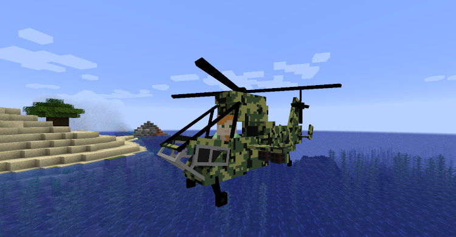
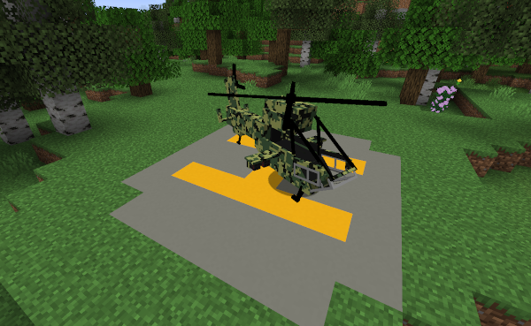
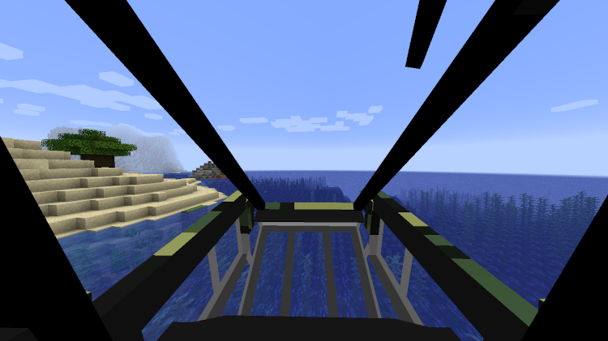
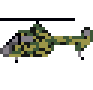

# minecraft-helicopter

## What is it
This is a minecraft mod that adds usable helicopters to minecraft

### controls
- arrow keys to move up and down
- W & S to move
- A & D to turn

### crafting
The mod also adds helicopter parts and rotor blades to add depth
to the crafting recipe and make helicopters late game

## Installation
WIP

TODO check details, naming etc

This mod uses Fabric (link), docs etc

How to install:
- assuming you've already got minecraft installed
- download Fabric installer
- run the Fabric installer
  - point at existing Minecraft installation
  - tell it to install version xxx
- this will create something that looks like a separate minecraft version/installation
- create `mods` folder
- download fabric API & put into mods folder
- copy this into mods folder

## Source code
A link to the source code can be found [here](https://github.com/brunokirby/minecraft-helicopter)

